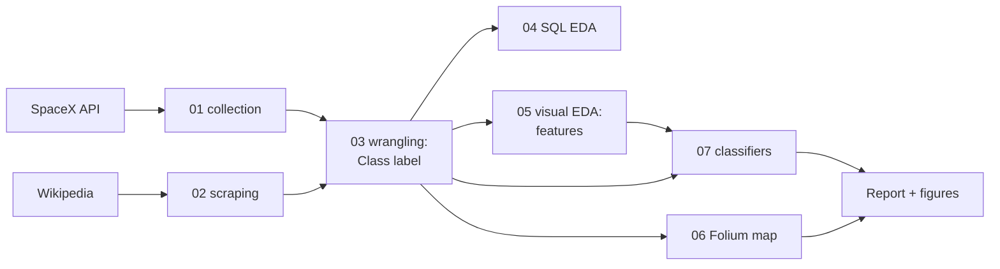
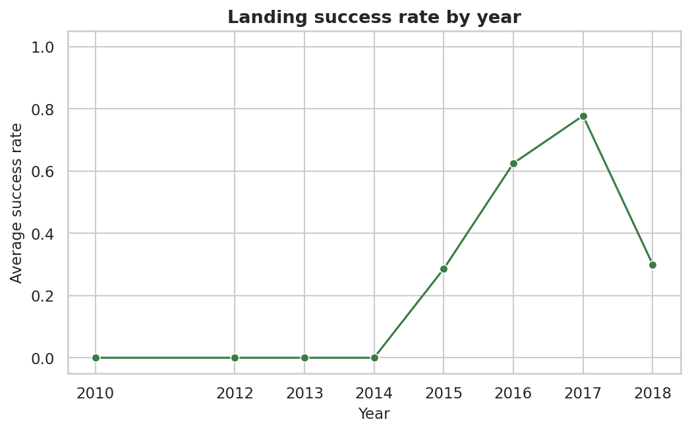
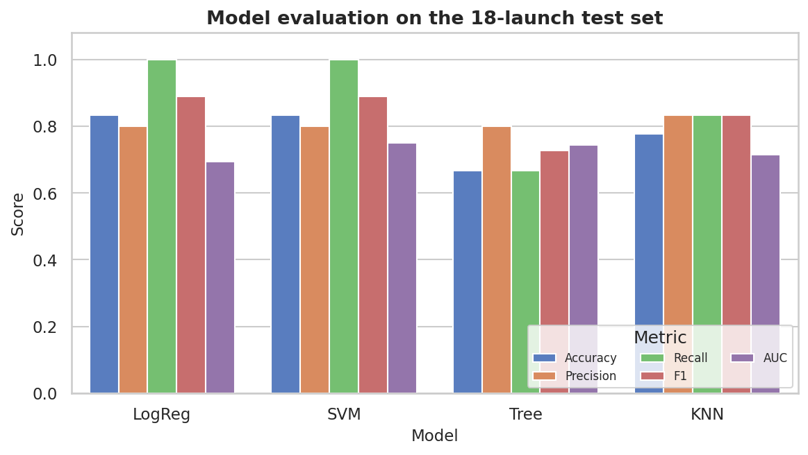

# Falcon 9 First-Stage Landing Prediction

**A reproducible study of SpaceX Falcon 9 landings — from API collection and
Wikipedia scraping to an interactive map and four classifiers.**

[](https://www.python.org/)
[](https://dash.plotly.com/)
[](https://scikit-learn.org/)
[](LICENSE)

## At a glance

| | |
|---|---|
| **Question** | Will a Falcon 9 first stage land successfully? |
| **Data** | SpaceX API + Wikipedia launch table (public) |
| **Modelling set** | 90 labelled Falcon 9 launches (2010–2020) |
| **Best models** | Logistic regression / SVM, F1 ≈ 0.89 on an 18-launch holdout |
| **Stack** | pandas, scikit-learn, seaborn, Plotly Dash, Folium |
| **Licence** | MIT (code) · CC BY-SA 4.0 (Wikipedia-derived data) |

> Not affiliated with, sponsored by, or endorsed by IBM or SpaceX.

## Documentation map

| Document | Contents |
|----------|----------|
| [`reports/report.md`](reports/report.md) | The report of record, with embedded figures |
| [`reports/limitations.md`](reports/limitations.md) | Honest limitations and next steps |
| [`docs/methodology.md`](docs/methodology.md) | End-to-end pipeline |
| [`docs/data-dictionary.md`](docs/data-dictionary.md) | Processed-data columns |
| [`docs/NOTEBOOK_GUIDE.md`](docs/NOTEBOOK_GUIDE.md) | Per-notebook walkthrough |
| [`docs/FILE_CATALOG.md`](docs/FILE_CATALOG.md) | Every file and its role |
| [`reports/figures/README.md`](reports/figures/README.md) | Figure manifest |
| [`notebooks/README.md`](notebooks/README.md) | How to run the notebooks |
| [`dashboard/README.md`](dashboard/README.md) | How to run the dashboard |

## Pipeline



## Results

Landing success improves sharply over the programme, and a linear classifier
separates successes from failures with an F1 of about 0.89 on a small holdout.

| Figure | |
|---|---|
|  |  |

The tuned decision tree is the cautionary example: it has the best cross-validated
accuracy (0.943) but only 0.667 test accuracy — overfitting on 90 launches. See
[`reports/report.md`](reports/report.md) for the full comparison and
[`reports/limitations.md`](reports/limitations.md) for the caveats.

## Quickstart

```bash
git clone https://github.com/malikb0/falcon9-landing-analysis.git
cd falcon9-landing-analysis

python -m venv .venv
source .venv/bin/activate          # Windows: .venv\Scripts\activate
pip install -r requirements.txt

# run the tests
make test

# regenerate figures and the interactive map
make report

# execute the offline notebooks (03, 05, 07)
make nb

# launch the dashboard
python dashboard/app.py            # then open http://127.0.0.1:8050
```

Notebooks 01, 02 and 06 need network access; 04 needs `jupysql`. All are
documented in [`notebooks/README.md`](notebooks/README.md).

## Repository layout

```
falcon9-landing-analysis/
├── README.md
├── NOTICE.md
├── LICENSE
├── CITATION.cff
├── requirements.txt
├── Makefile
├── data/
│   ├── raw/
│   └── processed/
├── notebooks/
│   ├── 01-data-collection-api.ipynb
│   ├── 02-web-scraping.ipynb
│   ├── 03-data-wrangling.ipynb
│   ├── 04-eda-sql.ipynb
│   ├── 05-eda-visualization.ipynb
│   ├── 06-interactive-map.ipynb
│   └── 07-ml-landing-prediction.ipynb
├── dashboard/
│   ├── app.py
│   └── README.md
├── reports/
│   ├── report.md
│   ├── limitations.md
│   ├── figures/
│   └── maps/launch_sites.html
├── docs/
├── scripts/make_figures.py
└── tests/
```

A full tree and file catalog are in [`docs/STRUCTURE.md`](docs/STRUCTURE.md) and
[`docs/FILE_CATALOG.md`](docs/FILE_CATALOG.md).

## Attribution

This project originated as the capstone of the **IBM Applied Data Science** course;
the study is re-authored here and is not affiliated with IBM. Launch data comes from
the public **SpaceX API**, and the scraped launch table derives from **Wikipedia**
under **CC BY-SA 4.0**. Full details are in [`NOTICE.md`](NOTICE.md).

## License

[MIT](LICENSE) © 2026 Malik Awais. Wikipedia-derived data remains CC BY-SA 4.0.
