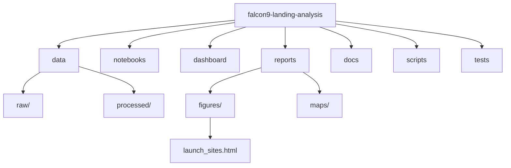

# Repository structure



## Directory tree

```
falcon9-landing-analysis/
├── README.md
├── NOTICE.md
├── LICENSE
├── CITATION.cff
├── requirements.txt
├── Makefile
├── data/
│   ├── README.md
│   ├── raw/
│   │   ├── launch_dict.csv
│   │   ├── spacex_launch.csv
│   │   └── spacex_web_scraped.csv
│   └── processed/
│       ├── dataset_part_1.csv
│       ├── dataset_part_2.csv
│       ├── dataset_part_3.csv
│       ├── spacex_launch_dash.csv
│       └── spacex_launch_geo.csv
├── notebooks/
│   ├── README.md
│   ├── 01-data-collection-api.ipynb
│   ├── 02-web-scraping.ipynb
│   ├── 03-data-wrangling.ipynb
│   ├── 04-eda-sql.ipynb
│   ├── 05-eda-visualization.ipynb
│   ├── 06-interactive-map.ipynb
│   └── 07-ml-landing-prediction.ipynb
├── dashboard/
│   ├── README.md
│   └── app.py
├── reports/
│   ├── README.md
│   ├── report.md
│   ├── limitations.md
│   ├── figures/
│   │   ├── README.md
│   │   └── *.png
│   └── maps/
│       └── launch_sites.html
├── docs/
│   ├── README.md
│   ├── methodology.md
│   ├── data-dictionary.md
│   ├── NOTEBOOK_GUIDE.md
│   ├── STRUCTURE.md
│   └── FILE_CATALOG.md
├── scripts/
│   ├── README.md
│   └── make_figures.py
├── tests/
│   ├── README.md
│   ├── test_data_contract.py
│   └── test_model_smoke.py
└── Makefile
```

See [`FILE_CATALOG.md`](FILE_CATALOG.md) for the role of each file.
