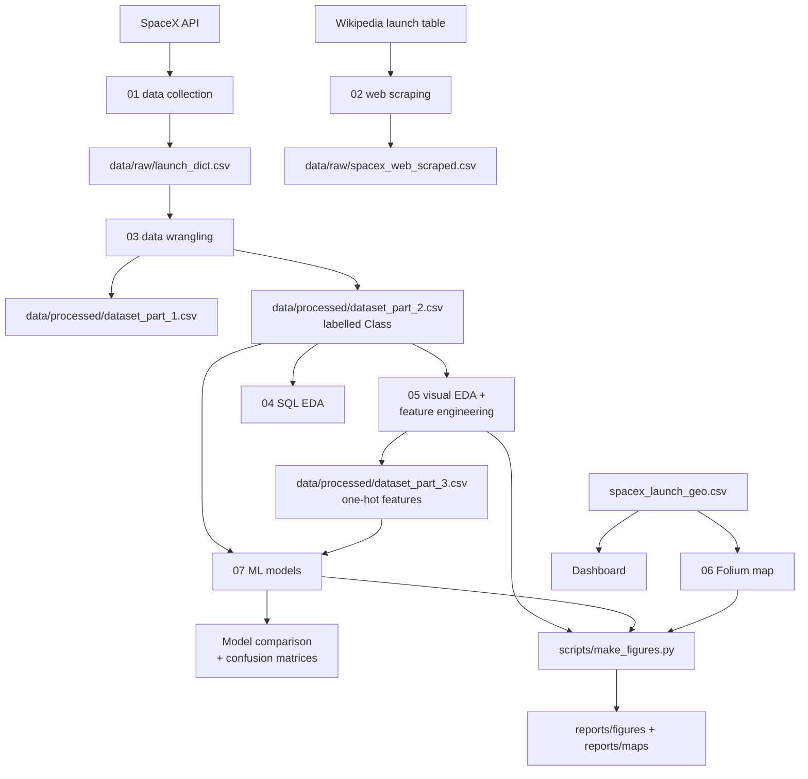

# Methodology

The study is a straight pipeline from public data to a classifier, with the
launch-site analysis running alongside the modelling branch.

## Stages

1. **Collection.** Notebook 01 queries the SpaceX API and flattens nested records;
   notebook 02 scrapes a pinned Wikipedia snapshot. Outputs land in `data/raw/`.
2. **Wrangling and labelling.** Notebook 03 loads the Falcon 9 table, explores it,
   and defines the binary `Class` label (successful landing or not).
3. **Exploratory analysis.** Notebook 04 answers concrete questions in SQL; notebook
   05 visualises the relationships and one-hot encodes the features.
4. **Spatial view.** Notebook 06 maps the launch sites and their proximity to
   coastline, roads and cities with Folium; `dashboard/app.py` gives an interactive
   payload/outcome view.
5. **Modelling.** Notebook 07 trains logistic regression, SVM, decision tree and KNN
   with grid search and compares them with several metrics.
6. **Presentation.** `scripts/make_figures.py` regenerates the curated figures and
   the interactive map, which are embedded in `reports/report.md`.

## Reproducibility choices

- The train/test split is **stratified** and seeded (`random_state=2`).
- The feature scaler is fitted on the **training split only**.
- Notebooks 03 and 05 reproduce `dataset_part_2.csv` and `dataset_part_3.csv`
  value-for-value from the shipped `dataset_part_1.csv`.
- `make test` checks the data contract and a model accuracy floor.

See [`../reports/limitations.md`](../reports/limitations.md) for what this pipeline
does not establish.
