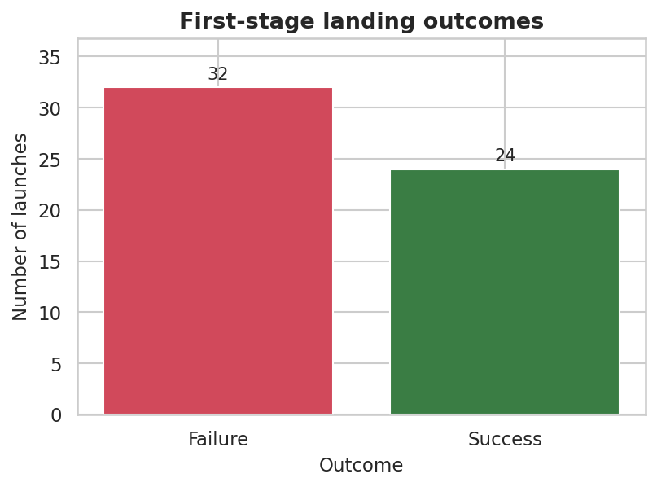
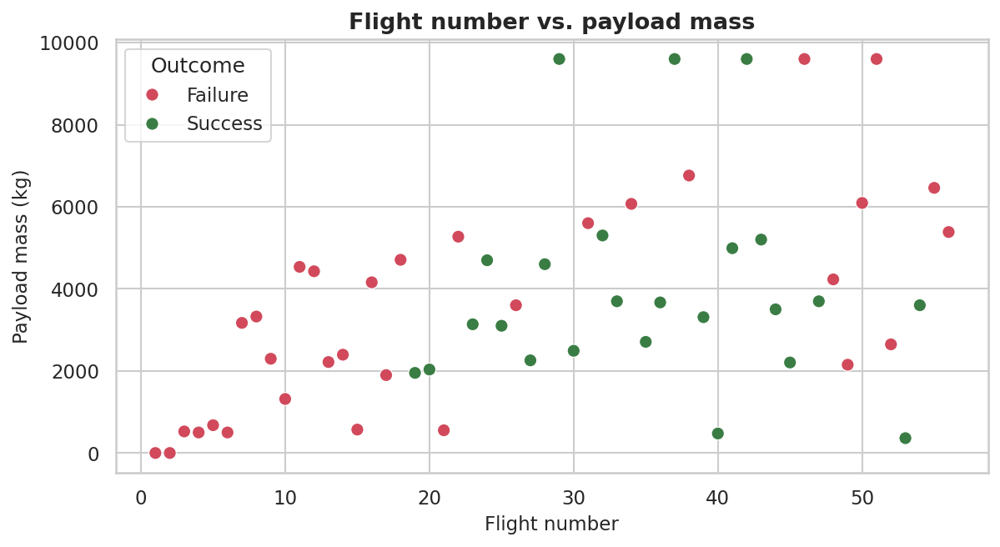
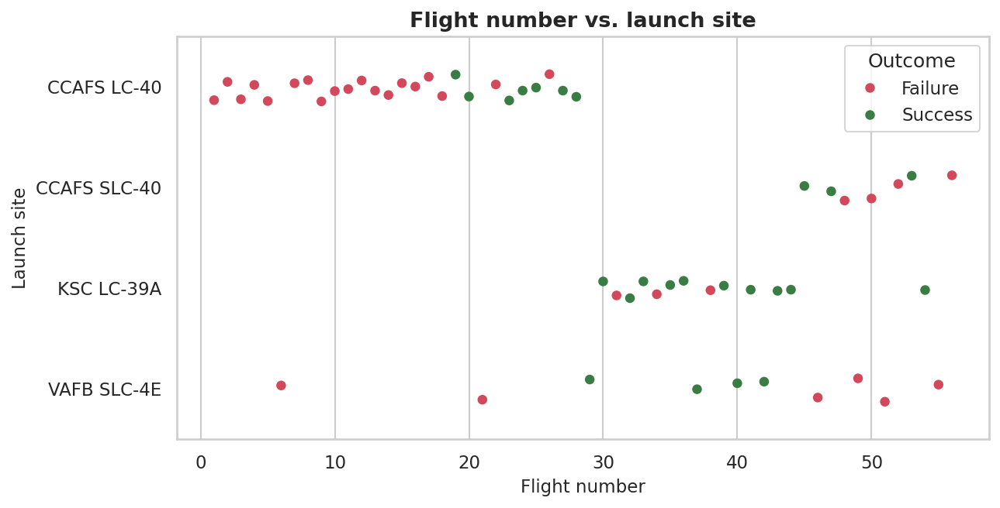
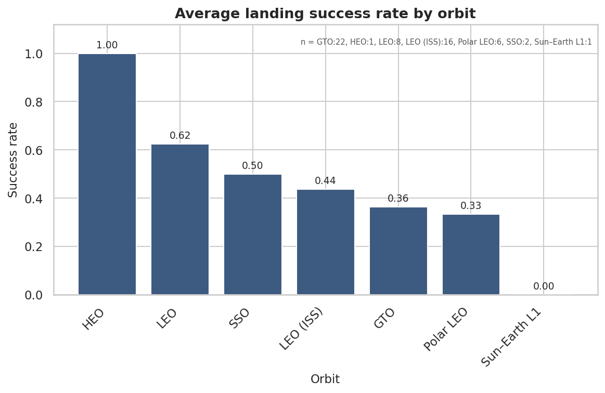
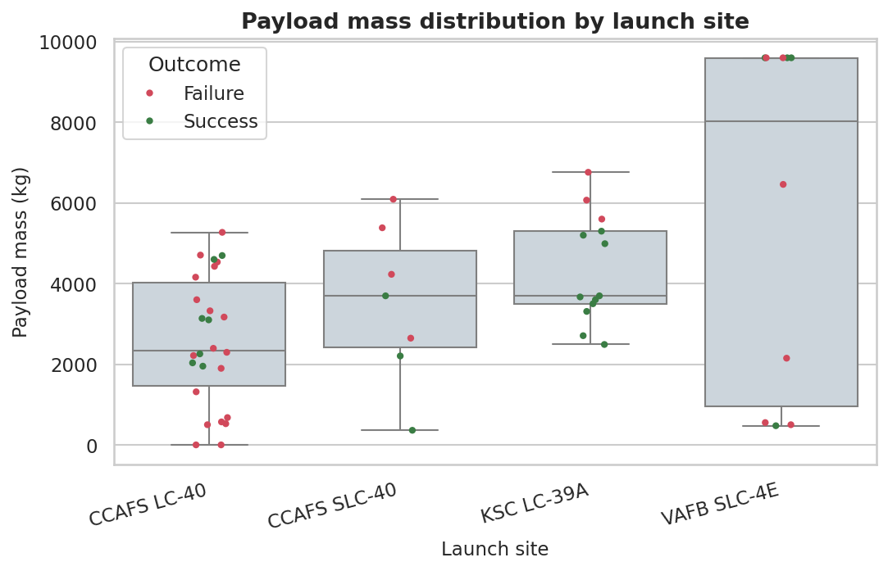
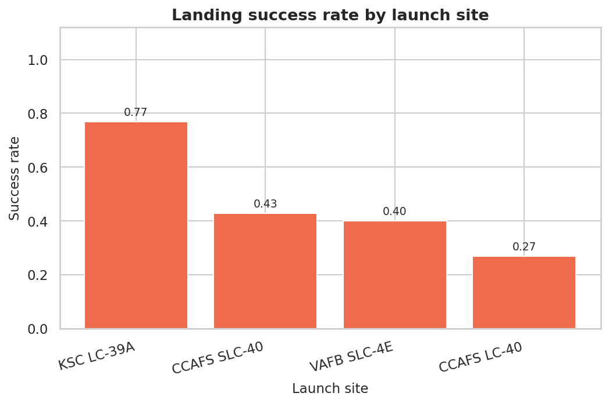
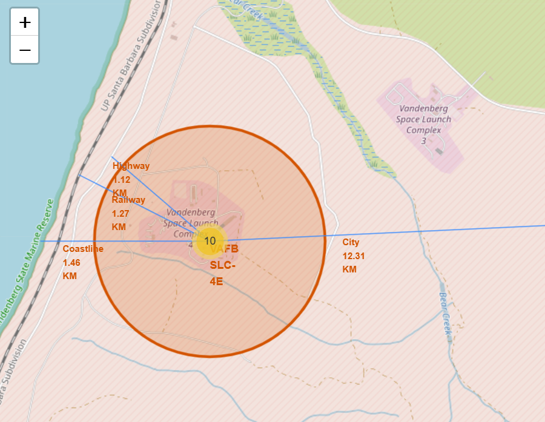
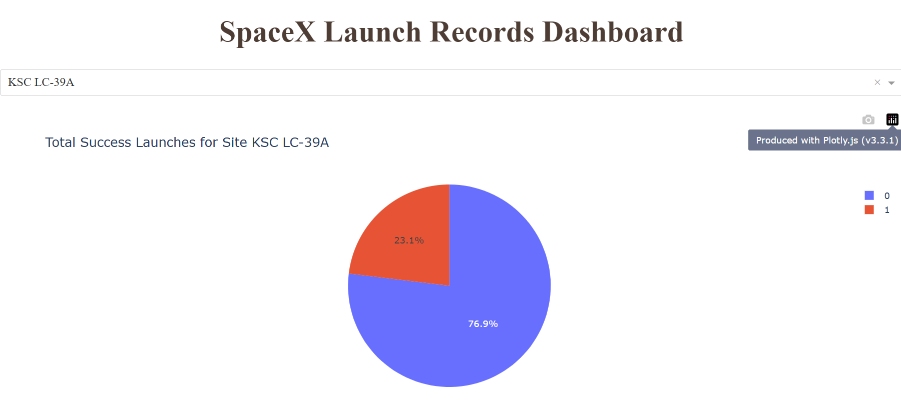
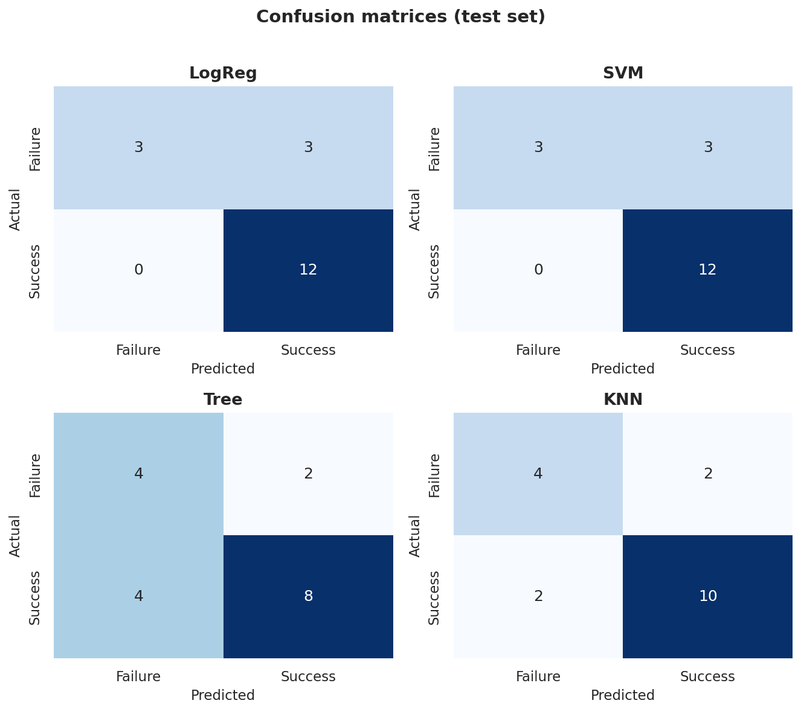

# Predicting Falcon 9 First-Stage Landing Success

*A reproducible study of SpaceX Falcon 9 first-stage landings, from data
collection to classification models.*

## Summary

SpaceX's advertised Falcon 9 launch price depends heavily on recovering and reusing
the first stage. This project collects the public launch history, labels every
Falcon 9 mission by whether its first stage landed, explores the data with SQL and
charts, maps the launch sites, and trains four classifiers to predict a successful
landing.

On a stratified 18-launch holdout, logistic regression and SVM were the strongest
classifiers by F1 (0.889) at 83.3% accuracy; a tuned decision tree had the best
cross-validated accuracy (0.943) but generalised poorly (0.667 test accuracy).
With only 90 labelled launches, the ranking is best read as directional rather than
final.



## 1. Introduction

A Falcon 9 first stage that returns to a landing pad or drone ship can fly again,
and that reuse is the main reason SpaceX can offer launches far below the price of
disposable rockets. Whether a given launch will be recovered is therefore a
practical question, and it is one that the public launch record can at least partly
answer.

The goal here is a small, end-to-end machine-learning study:

1. collect the launch history,
2. define a landing-success label,
3. explore the data,
4. build an interactive view of the launch sites,
5. train and compare classifiers, and
6. report the results honestly, including the caveats.

The pipeline and its artefacts are summarised in
[`../docs/methodology.md`](../docs/methodology.md).

## 2. Data and methods

Two public sources feed the study:

- the **SpaceX API** (`api.spacexdata.com/v4`), which provides the structured launch,
  payload, core and landing fields, and
- a **Wikipedia** table of Falcon 9 / Falcon Heavy launches, scraped for a second,
  independently sourced record.

The API records are flattened into `dataset_part_1.csv`, labelled in
`dataset_part_2.csv`, and one-hot encoded into `dataset_part_3.csv`. The label,
`Class`, is `1` when the first stage landed successfully and `0` otherwise; a
`None None` outcome — no landing attempt — counts as `0`. Across the 90 labelled
launches the success rate is 66.7% (60 successes, 30 failures).

The dashboard and launch-site analysis use a separate 56-launch table spanning
2010–2018, which is why its success share (24/56) is lower than the modelling
dataset's. This difference is a known limitation, not an error.

## 3. SQL exploratory analysis

Loading the launch table into SQLite allows the outcome history to be queried
directly. From the archived SQL notebook:

| Question | Result |
|----------|--------|
| Launch sites in the data | CCAFS LC-40, CCAFS SLC-40, KSC LC-39A, VAFB SLC-4E |
| Total payload launched for NASA (CRS) | 45,596 kg |
| Average payload for Falcon 9 v1.1 | 2,928.4 kg |
| First successful ground-pad landing | 2015-12-22 |
| Drone-ship successes with 4,000–6,000 kg payload | F9 FT B1022, F9 FT B1026, F9 FT B1021.2, F9 FT B1031.2 |
| Heaviest payload | 15,600 kg, carried by several Block 5 boosters |
| 2015 drone-ship failures | January (B1012) and April (B1015), both CCAFS LC-40 |

Between 2010-06-04 and 2017-03-20 the ranked landing outcomes were: No attempt 10,
Success (drone ship) 5, Failure (drone ship) 5, Success (ground pad) 3, Controlled
(ocean) 3, Uncontrolled (ocean) 2, Failure (parachute) 2 and Precluded (drone ship)
1. The early dominance of "No attempt" and ocean/parachute outcomes is what makes
the first years look so unsuccessful.

## 4. Visual exploratory analysis

Plotting payload mass against flight number shows that early flights carried little
payload and mostly failed, while later, heavier flights succeed far more often.



Grouping by launch site shows the same story along the time axis: CCAFS LC-40
carried most of the early, less reliable flights, while the other sites were used
later as the landing record improved.



Orbit matters too. The high points of the orbit success-rate chart are the orbits
flown later in the programme (GEO, HEO, SSO, ES-L1), while the mixed GTO record
reflects many of the early high-energy missions.



The yearly trend makes the improvement clearest: 0.00 in 2010–2013, 0.33 in
2014–2015, 0.63 in 2016, 0.83 in 2017, 0.90 in 2019 and 0.84 in 2020.


Payload mass is also distributed unevenly across sites: VAFB SLC-4E flew no heavy
payloads above ~10,000 kg, while the heavier missions clustered at CCAFS SLC-40 and
KSC LC-39A.





## 5. Interactive launch-site map

The launch sites sit close to coastlines, railways, highways and cities, which
matters for transporting and recovering stages. An interactive Folium map marks
every site and every launch, colour-coded by outcome, and draws the distance from a
site to nearby features. The committed interactive version is at
[`maps/launch_sites.html`](maps/launch_sites.html), with a snapshot below.



The dashboard exposes the same data interactively, letting a user filter by launch
site and payload range.



## 6. Predictive modelling

Four classifiers were trained on the one-hot encoded features with a 10-fold grid
search:

- **Logistic regression** over `C`;
- **Support vector machine** over kernel, `C` and `gamma`;
- **Decision tree** over depth, split criterion and leaf settings;
- **K-nearest neighbours** over the number of neighbours and distance metric.

Two methodological fixes were applied and recorded (see
[`limitations.md`](limitations.md) and the readiness report):

1. the train/test split is now **stratified**, so the holdout keeps the class
   balance (12 successes, 6 failures in 18 launches), and
2. the feature scaler is fitted on the **training split only**, removing the
   test-set information leak in the original.

## 7. Results

Test-set metrics (18 launches):

| Model | Accuracy | Precision | Recall | F1 | AUC | CV accuracy |
|-------|---------:|----------:|-------:|---:|----:|------------:|
| Logistic regression | 0.833 | 0.800 | 1.000 | **0.889** | 0.694 | 0.850 |
| SVM | 0.833 | 0.800 | 1.000 | **0.889** | 0.750 | 0.864 |
| Decision tree | 0.667 | 0.800 | 0.667 | 0.727 | 0.743 | **0.943** |
| KNN | 0.778 | 0.833 | 0.833 | 0.833 | 0.715 | 0.864 |


Because the classes are imbalanced, **F1 for the `land` class is the headline
metric**. Logistic regression and SVM tie on F1 (0.889) and accuracy (0.833); both
find every successful landing (recall 1.000) and pay for it with false positives.
The decision tree is the cautionary tale: its 0.943 cross-validated accuracy does
not survive the holdout (0.667), a textbook sign of overfitting on a small sample.



With 18 test launches, each one is worth ~5.6 percentage points of accuracy, so the
gap between the top and bottom model is only a handful of launches. The honest
conclusion is that logistic regression or SVM is a reasonable default here, and
that a larger sample is needed before claiming a winner.

## 8. Limitations

The full list is in [`limitations.md`](limitations.md). The most important points:
the two datasets cover different windows; the holdout is very small; the feature
matrix has more columns than rows; and the cross-validation folds are not
stratified. The results are directional, not definitive.

## 9. Conclusion

The Falcon 9 first-stage landing record improves dramatically over time, and a
simple linear classifier can separate successful landings from failures on this
snapshot with an F1 of about 0.89. Orbit, payload mass and launch site are all
associated with the outcome, but the dataset is too small for a strong claim about
which model is best. The reproducible pipeline — collection, labelling, EDA, mapping
and modelling — is the durable output.

## Reproducing this analysis

```bash
python -m venv .venv
source .venv/bin/activate
pip install -r requirements.txt

# regenerate figures and the interactive map
python scripts/make_figures.py

# execute the offline notebooks
jupyter nbconvert --to notebook --execute --inplace notebooks/03-data-wrangling.ipynb
jupyter nbconvert --to notebook --execute --inplace notebooks/05-eda-visualization.ipynb
jupyter nbconvert --to notebook --execute --inplace notebooks/07-ml-landing-prediction.ipynb

# run the tests
make test
```

See [`../docs/methodology.md`](../docs/methodology.md) for the end-to-end pipeline
and [`../notebooks/README.md`](../notebooks/README.md) for the notebook guide.
